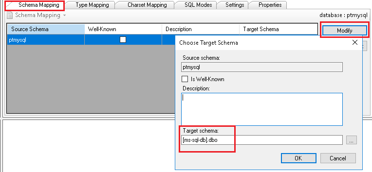

# Migration Guide: MySQL to MS-SQL

## Prerequisites

* Currently, MySQL 5.6 and 5.7 are supported
* SQL Server Migration Assistant for MySQL (SSMA for MySQL)
* SSMA as well as it's dependenecies can be downloaded from releases - SQL Server Migration Assistant node. Install the files in the numbered order
* Connectivity to both the MySQL and MS-SQL DBs from the host that the SSMA is installed on (may require openning of remote access hosts in the relevant SQL configuration files)

## Reference
Refer to the link below for the full article. Support article is a summary 
[https://learn.microsoft.com/en-us/sql/sql-server/migrate/guides/mysql-to-sql-server?view=sql-server-ver16](https://learn.microsoft.com/en-us/sql/sql-server/migrate/guides/mysql-to-sql-server?view=sql-server-ver16)

## Pre-Migration

**1. SSMA > File > New Project**
* Name
* Migrate to - SQL Server version

**2. Ribbon > Connect to MySQL**
* Enter the MySQL server details and credentials
* Select the MySQL database you want to migrate

**3. Ribbon > Create Report**
* Review the HTML report to understand conversion statistics and any errors or warnings

**4. Tools > Project Settings > Type Mapping**
*  Validate the type mappings

**5. Ribbon > Connect to SQL Server**
* Enter the MS-SQL server details and credentials

**6. MySQL Metadata Explorer > Schema Mapping > Modify**
* Change the target schema e.g. `[ms-sql-db].ptmysql`   ->   `[ms-sql-db].dbo`  
  

**7. Ribbon > Convert Schema**
* After the conversion finishes, compare and review the converted objects to the original objects to identify potential problems and address them based on the recommendations

## Migration

**1. SQL Server Metadata Explorer > Right-click DB > Synchronize with Database**
* This action publishes the MySQL database to the SQL Server instance

**2. MySQL Metadata Explorer > Right-click DB > Migrate Data**
* After migration is completed, view the Data Migration Report
* Connect to your SQL Server instance by using SQL Server Management Studio, and validate the migration by reviewing the data and schema
